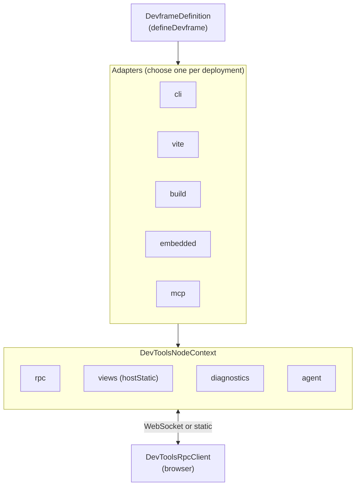

# Devframe

**Devframe is an asset: define your devtool once, serve it anywhere.** You describe a single tool — its RPC surface, its data model, its SPA, its CLI shape — and the same definition deploys through any of the runtime adapters: a standalone CLI, a self-contained static report, an embedded SPA, an MCP server, and more. Devframe is framework- and build-tool-agnostic — it has no Vite dependency and no opinion on what UI framework your SPA uses.

[Vite DevTools](https://devtools.vite.dev/) is built on top of devframe. If you need an integrated multi-tool host (docks, command palette, terminals, cross-tool toasts), mount your devframe into Vite DevTools via the [`vite` adapter](./adapters#vite) — or build your own host adapter targeting any environment you like.

> [!WARNING] Experimental
> The Devframe API is still in development and may change between versions. The agent-native surface (`agent` on `defineRpcFunction`, `ctx.agent`, and the MCP adapter) is additionally flagged as experimental.

## Design principles

Devframe keeps its surface focused on one tool, so the same definition stays portable across runtimes:

- **One tool per definition.** A devframe describes a single integration. Deploy it through any adapter; host-level features that only matter when several tools share a UI (palettes, cross-tool toasts, unified terminals) come from whichever host you mount into — Vite DevTools is one example.
- **Headless.** Hook into `onReady`, `cli.configure`, and friends to print your own startup banners and styling — Devframe stays out of the way.
- **App-owned file watching.** Wire your own watcher (chokidar, fs.watch, …) and signal change via `ctx.rpc.sharedState.set(...)` or event-typed RPCs.
- **Context-aware mount paths.** Standalone adapters (`cli`, `spa`, `build`) serve at `/` by default; hosted adapters (`vite`, `embedded`) serve at `/.<id>/`. Override via `DevframeDefinition.basePath`.
- **SPAs own their base at runtime.** Build with relative asset paths (`vite.base: './'`); `connectDevframe` discovers the effective base from the executing script's location.
- **CLI flags compose.** The `cac` instance is exposed to both the devframe (`cli.configure`) and the caller of `createCli`, so capability flags and app flags merge cleanly.

## What Devframe provides

| Subsystem | What it does |
|-----------|--------------|
| **[Devframe Definition](./devframe-definition)** | One `defineDevframe` call describes your tool once; the adapters deploy it anywhere. |
| **[RPC](./rpc)** | Type-safe bidirectional calls built on birpc + valibot. Supports `query`, `static`, `action`, and `event` types. |
| **[Shared State](./shared-state)** | Observable, patch-synced state that survives reconnects and bridges server ↔ browser. |
| **[Diagnostics](./diagnostics)** | Coded warnings/errors via `logs-sdk` — registered into the host logger so adapters and consumers share the same surface. |
| **[Streaming](./streaming)** | One-way (RPC streaming) and two-way (uploads) channel primitives for long-running data. |
| **[When Clauses](./when-clauses)** | VS Code-style conditional expressions for docks, commands, and custom UI. |
| **[Utilities](./utilities)** | Bundled helpers under `devframe/utils/*` — terminal colors, hashing, editor launch, structured-clone serialization, and more. |
| **[Client](./client)** | Browser-side RPC client (`connectDevframe`) with auto-auth and WebSocket / static modes. |
| **[Agent-Native](./agent-native)** | Opt-in exposure of your tool's surface to coding agents over MCP. |

## Architecture



Hosts (Vite DevTools is one) can wrap the same definition with their own adapter to augment `ctx` with extras like docks, terminals, and a command palette.

## Install

```sh
pnpm add devframe
```

`devframe` ships ESM-only and has no Vite dependency. Adapters with optional peers (the MCP adapter needs `@modelcontextprotocol/sdk`) surface the requirement at import time.

## Hello, Devframe

A minimal devframe with a CLI entry point:

```ts twoslash
import { defineDevframe, defineRpcFunction } from 'devframe'
import { createCli } from 'devframe/adapters/cli'

const devframe = defineDevframe({
  id: 'my-devframe',
  name: 'My Devframe',
  icon: 'ph:gauge-duotone',
  cli: {
    distDir: 'client/dist',
  },
  setup(ctx) {
    ctx.rpc.register(defineRpcFunction({
      name: 'my-devframe:hello',
      type: 'static',
      jsonSerializable: true,
      handler: () => ({ message: 'hello' }),
    }))
  },
})

await createCli(devframe).parse()
```

The same definition can also be deployed through any of the other adapters — for example, mounted into Vite DevTools via the [`vite` adapter](./adapters#vite).

Run it:

```sh
node ./my-devframe.js        # dev server on http://localhost:9999/
node ./my-devframe.js build  # self-contained static deploy in dist-static/
node ./my-devframe.js mcp    # stdio MCP server (experimental)
```

The CLI adapter serves the SPA at `/` by default. When the same devframe is embedded inside a host (`vite`, `embedded`), the default becomes `/.my-devframe/`. Override either side via `defineDevframe({ basePath })`.

## Adapters at a glance

Devframe deploys the same `DevframeDefinition` through one of these adapters:

| Adapter | Entry | Target |
|---------|-------|--------|
| `cli` | `createCli(d).parse()` | Standalone CLI with dev / build / mcp subcommands |
| `vite` | `createPluginFromDevframe(d, opts?)` *(from `@vitejs/devtools-kit/node`)* | Mount the devframe into Vite DevTools (or another compatible host) |
| `build` | `createBuild(d, opts?)` | Self-contained static deploy with baked RPC dumps |
| `embedded` | `createEmbedded(d, { ctx })` | Runtime registration into an existing host |
| `mcp` | `createMcpServer(d, opts)` | Model Context Protocol server |

See [Adapters](./adapters) for the full reference.

## Framework- and build-tool-agnostic

Devframe has zero dependencies on Vite or any `@vitejs/*` package — the same definition runs in any Node environment, with any UI framework, against any build tool. Vite DevTools is one host built on top of devframe; mount your definition there with the [`vite` adapter](./adapters#vite), or write adapters for any other host.

## What's next

- [Devframe Definition](./devframe-definition) — understand `defineDevframe` and the `DevToolsNodeContext`
- [Adapters](./adapters) — pick the right deployment target for your tool
- [RPC](./rpc) — define type-safe server functions your client can call
- [Agent-Native](./agent-native) — expose your devframe to Claude Desktop, Cursor, or any MCP client
